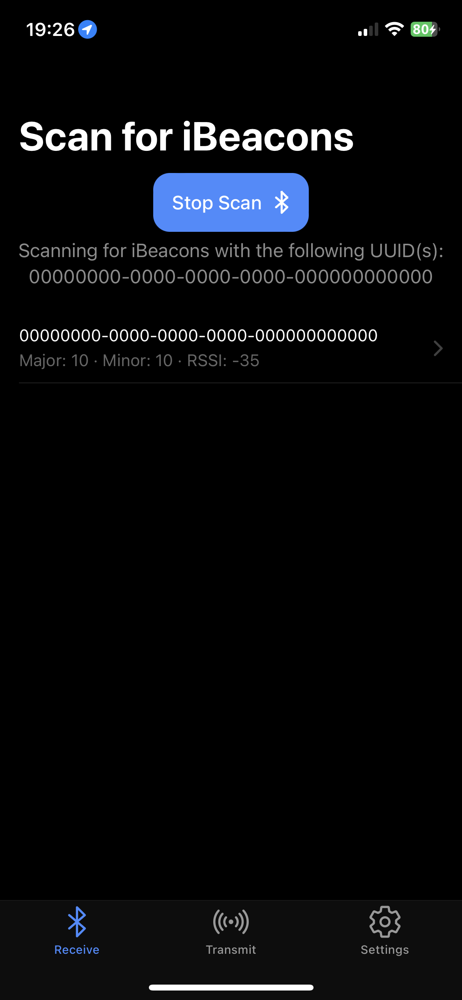
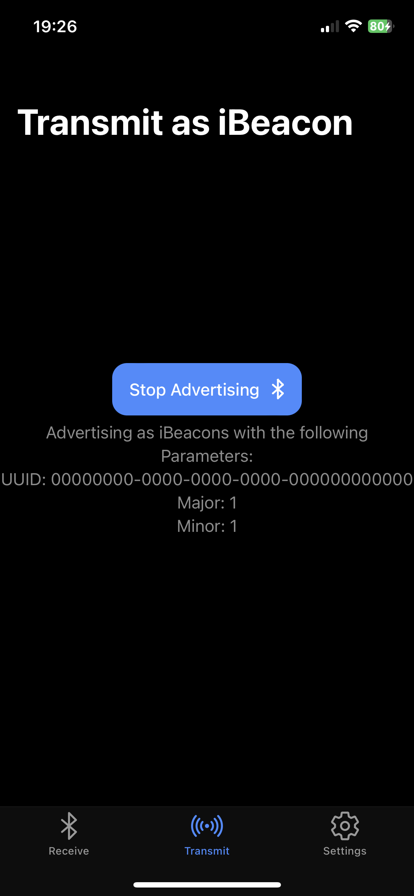
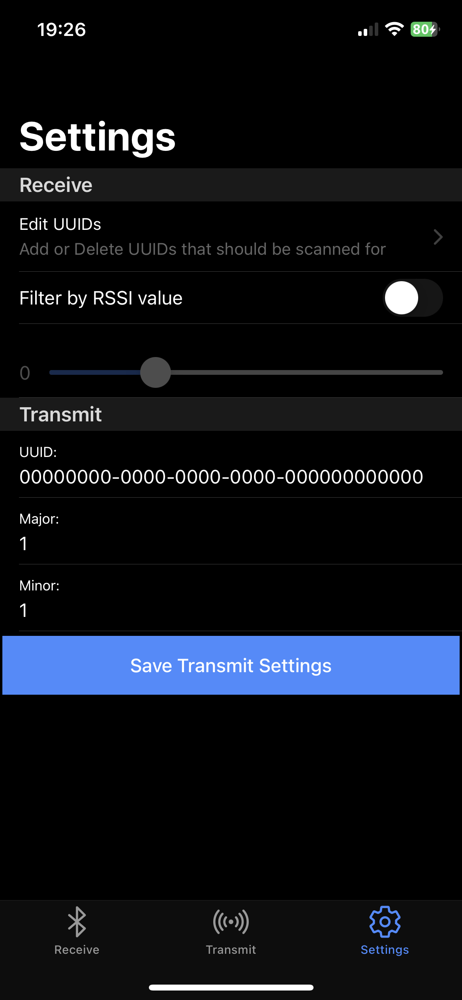

# iScanner

<p float="left">



</p>

## Overview

iScanner is an IOS app that can be used to scan for and advertise as an iBeacon device. iBeacon is a technology developed by Apple that allows mobile devices to detect and interact with beacons placed in the physical environment. The App is split into three tabs:

- **Receive:** Scan for nearby iBeacons.
- **Transmit:** Advertise as an iBeacon.
- **Settings**: Configure scan and advertisement parameters.

## 🪄 Features

- Scanning iBeacon(s): Scan for nearby iBeacons by supplying one or several UUIDs. The information of all nearby iBeacons that are comply to the supplied UUIDs are displayed in a list, including UUID, major, minor, proximity and RSSI (Received Signal Strength Indicator).
- Advertising iBeacon: Turn your smartphone into an iBeacon. This allows other devices to scan and detect your phone as an iBeacon.


## 🔧 Architecture

The application is built using the Ionic/Angular framework.

- Ionic:
    - Ionic CLI                     : 7.1.1
    - Ionic Framework               : @ionic/angular 7.2.2
    - @angular-devkit/build-angular : 16.1.8
    - @angular-devkit/schematics    : 16.1.8
    - @angular/cli                  : 16.1.8
    - @ionic/angular-toolkit        : 9.0.0
- Capacitor:
    - Capacitor CLI      : 5.2.2
    - @capacitor/android : not installed
    - @capacitor/core    : 5.2.2
    - @capacitor/ios     : 5.2.2
- System:
    - NodeJS : v18.17.0
    - npm    : 9.6.7
    - OS     : macOS


## Installation

Follow these steps to set up and run the application:

1. Install Node.js and npm if you haven't already. I recommend using [nvm](https://github.com/nvm-sh/nvm) for Node.js installation.

2. Install Ionic CLI globally:
```bash
npm install -g @ionic/cli
```

3. Clone the repository and navigate to the project folder:

```bash
git clone <repository-url>
cd project-folder
```

4. Install the project dependencies:

```bash
npm install
```
5. To run the app in the browser for development:
```bash
ionic serve
```
6. To run the app on a physical device or simulator:

For iOS:

```bash
ionic cap run ios
```
